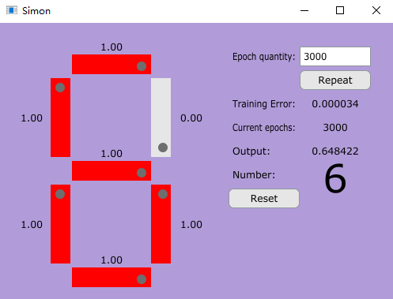

# Simon

Simon's one of my first attempts at using Neural Networks, as clicking the grey faders on the left of the UI will let Simon generate the respective number it matches if your Epoch count is high enough (recommended between ~1000-3000). For example, turning all faders to 1.0 will 
look like the number "8", and Simon will print the number 8 on the right of the UI. 

Simply clone the repo and click 'simon.exe' in the main directory to play around with the faders, or experiment with the .sln file and install JUCE if you'd like to customise Simon.

I definitely recommend playing around with having a low Epoch count vs an Epoch count of roughly ~3000, as you'll be able to see an improvement in Simon's accuracy.
